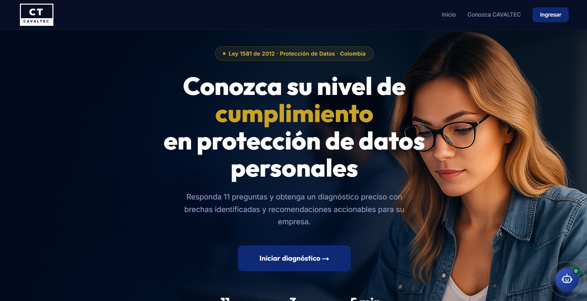
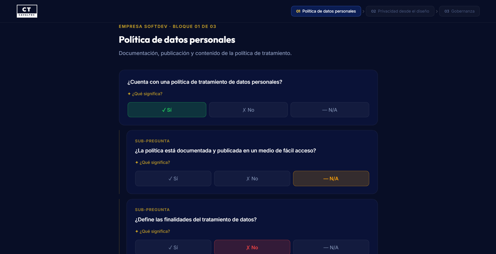
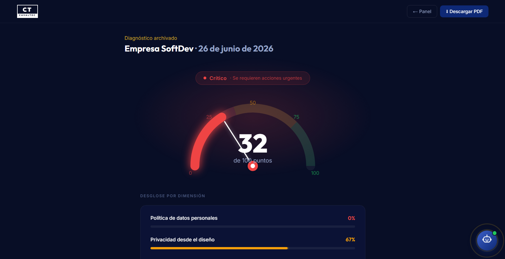
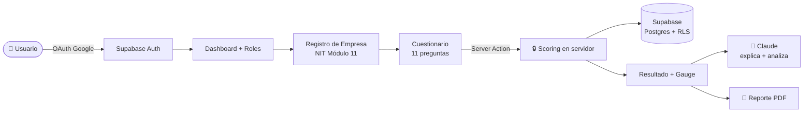

# 🛡️ CAVALTEC — Autodiagnóstico de Cumplimiento (Ley 1581)


-D97757?logo=anthropic&logoColor=white)


> Aplicación web que permite a cualquier empresa **medir su nivel de cumplimiento de la Ley 1581 de 2012** (protección de datos personales, Colombia) en la fase de diseño — detectando brechas y generando un plan de acción accionable, asistido por IA.

**[🌐 Probar la app en vivo](https://cavaltechackathon.vercel.app)** · **[🏢 Conozca CAVALTEC](https://www.cavaltec.com/)**

---



<table>
<tr>
<td width="50%"></td>
<td width="50%"></td>
</tr>
<tr>
<td align="center"><sub><b>Cuestionario por bloques</b><br/>11 preguntas ponderadas con lógica padre-hijo</sub></td>
<td align="center"><sub><b>Resultado y diagnóstico</b><br/>Gauge, desglose por dimensión y brechas</sub></td>
</tr>
</table>

## 📑 Tabla de contenidos

- [✨ Qué hace](#-qué-hace)
- [🎯 Funcionalidades](#-funcionalidades)
- [🏗️ Arquitectura](#️-arquitectura)
- [🧰 Stack tecnológico](#-stack-tecnológico)
- [📊 Cómo funciona el diagnóstico](#-cómo-funciona-el-diagnóstico)
- [🚀 Correr localmente](#-correr-localmente)
- [📁 Estructura del proyecto](#-estructura-del-proyecto)
- [🔐 Seguridad](#-seguridad)
- [🧭 Cumplimiento aplicado al propio producto](#-cumplimiento-aplicado-al-propio-producto)
- [⚠️ Limitaciones y roadmap](#️-limitaciones-y-roadmap)
- [👥 Equipo](#-equipo)
- [💡 Sobre Talento Tech](#-sobre-talento-tech)
- [📜 Licencia](#-licencia)

---

## ✨ Qué hace

Muchas organizaciones colombianas deben cumplir la Ley 1581 pero **no tienen una herramienta simple** para saber qué tan bien aplican *privacidad desde el diseño*. CAVALTEC lo resuelve en cuatro pasos:

1. **Ingrese** con su cuenta de Google (OAuth) y registre su empresa.
2. **Responda** un cuestionario estructurado de 11 preguntas (fase de diseño).
3. **Obtenga** un porcentaje de cumplimiento, un diagnóstico visual y sus brechas detectadas.
4. **Reciba** recomendaciones priorizadas **adaptadas al sector y tamaño de su empresa**, un análisis con IA y un reporte PDF descargable.

---

## 🎯 Funcionalidades

| Función | Detalle |
|---------|---------|
| 🧮 **Motor de diagnóstico** | 11 preguntas ponderadas, lógica condicional padre-hijo, **scoring calculado en el servidor** |
| 🎯 **Recomendaciones personalizadas** | Las acciones y el análisis con IA se adaptan al **sector y tamaño** de la empresa (no son genéricas) |
| 🆔 **Validación de NIT real** | Algoritmo **Módulo 11 de la DIAN** — validado en TypeScript *y* en PostgreSQL |
| 🏢 **Multiempresa** | Aislamiento total por empresa mediante **Row Level Security** de Supabase |
| 👤 **Roles (RBAC)** | Administrador / Evaluador / Auditor con control real (UI + base de datos), invitaciones por email y guardas anti "último administrador" |
| 🤖 **IA aplicada** | Claude explica las preguntas en lenguaje simple (Haiku) y arma un plan de acción personalizado (Sonnet) |
| 💬 **Asistente Vale** | Chatbot nativo con Claude — versión pública en la landing (FAQ) y versión interna que conoce el diagnóstico de la empresa |
| 📄 **Reportes PDF** | Descargable, generado en el servidor, **con el análisis de IA y la personalización por perfil incluidos** |
| 📈 **Historial** | Cada empresa guarda y reabre sus diagnósticos pasados |
| 📲 **Asesoría directa** | CTA a WhatsApp con el contexto del diagnóstico precargado |
| 🔒 **Seguridad** | Auditoría OWASP propia, RBAC endurecido por RPC SECURITY DEFINER, security headers y defensa en profundidad |

---

## 🏗️ Arquitectura



**Decisiones clave:**

- **El puntaje se calcula siempre en el servidor.** El cliente manda respuestas, nunca el resultado — así nadie puede falsear su cumplimiento desde la consola.
- **El cuestionario vive en código** (config tipada), no en la base: es la fuente de verdad fija del reto.
- **La seguridad la garantiza la base.** El RLS aísla cada empresa a nivel de fila; aunque el código tuviera un bug, Postgres no deja ver datos ajenos.

---

## 🧰 Stack tecnológico

| Capa | Tecnología | Rol |
|------|------------|-----|
| Frontend + Backend | **Next.js 16** (App Router) | UI, Server Actions y Route Handlers |
| UI | **React 19** + **Tailwind CSS 4** | Componentes y sistema de diseño |
| Lenguaje | **TypeScript** (strict) | Tipado seguro en todo el proyecto |
| Auth + Base de datos | **Supabase** (PostgreSQL + RLS) | OAuth, persistencia y seguridad por fila |
| Inteligencia Artificial | **Claude** (Anthropic SDK) | Explicaciones (Haiku) y análisis (Sonnet) |
| Generación de PDF | **@react-pdf/renderer** | Reportes server-side |
| Hosting + CI/CD | **Vercel** | Deploy automático en cada `push` |

---

## 📊 Cómo funciona el diagnóstico

El cuestionario sigue la tabla oficial del reto, con **3 bloques ponderados** que suman 100%:

| Bloque | Peso máximo |
|--------|:-----------:|
| Política de datos personales | 40% |
| Privacidad desde el diseño | 36% |
| Gobernanza | 24% |

**Lógica condicional (padre-hijo):** la primera pregunta de Política es un *gate*. Si la empresa **no** tiene política de tratamiento, sus preguntas hijas se anulan automáticamente (no suman). Cada respuesta afirmativa suma su peso; el resultado es el % de cumplimiento, con las preguntas falladas convertidas en brechas priorizadas.

**Recomendaciones adaptadas al perfil:** sobre cada brecha se aplica una recomendación base estable + notas específicas según el **sector** (salud, financiero, educación, comercio, tecnología) y el **tamaño** (micro, pequeña, mediana, grande). El mismo P10 (oficial de protección de datos) genera consejos distintos para una microempresa comercial y una empresa financiera grande — sin perder la consistencia legal de la base.

---

## 🚀 Correr localmente

**Requisitos:** Node 20+, una cuenta de [Supabase](https://supabase.com) y una API key de [Anthropic](https://console.anthropic.com).

```bash
# 1. Clonar e instalar
git clone https://github.com/SalazarDukeImpactHub/cavaltechackathon.git
cd cavaltechackathon
npm install

# 2. Configurar variables de entorno
cp .env.local.example .env.local
```

Complete `.env.local` con sus valores:

```env
NEXT_PUBLIC_SUPABASE_URL=https://TU-PROYECTO.supabase.co
NEXT_PUBLIC_SUPABASE_ANON_KEY=tu-anon-o-publishable-key
NEXT_PUBLIC_SITE_URL=http://localhost:3000
ANTHROPIC_API_KEY=sk-ant-...   # solo servidor, nunca con prefijo NEXT_PUBLIC
```

```bash
# 3. Aplicar el esquema en Supabase (SQL Editor → Run, en este orden):
#    supabase/schema.sql
#    supabase/migrations/001_nit_validacion.sql
#    supabase/migrations/002_company_membership.sql
#    supabase/migrations/003_roles.sql
#    supabase/migrations/004_invitaciones.sql
#    supabase/migrations/005_roles_fix.sql

# 4. Configurar OAuth de Google en Supabase
#    Authentication → Providers → Google (Client ID + Secret)
#    Redirect URLs → http://localhost:3000/**

# 5. Correr
npm run dev   # http://localhost:3000
```

> 💡 La app funciona sin la `ANTHROPIC_API_KEY` (la IA se desactiva con gracia), pero pierde las explicaciones y el análisis.

---

## 📁 Estructura del proyecto

| Carpeta / archivo | Qué contiene |
|-------------------|--------------|
| `src/lib/diagnostico/` | Motor: preguntas (config), scoring, recomendaciones |
| `src/lib/nit/` | Validación de NIT (algoritmo Módulo 11 + tests) |
| `src/lib/ia/` | Integración con Claude (lógica pura + server actions) |
| `src/lib/empresa/` | Server actions de empresa, evaluaciones y miembros |
| `src/lib/reporte/` | Documento PDF (`@react-pdf`) |
| `src/lib/supabase/` | Clientes de Supabase (browser / server / proxy) |
| `src/app/` | Rutas: landing, login, dashboard, diagnóstico, evaluación, API |
| `src/components/` | Cuestionario, gauge, resultado, gestión de miembros, footer… |
| `supabase/` | Esquema SQL + migraciones (RLS, NIT, roles) |

---

## 🔐 Seguridad

Una app que predica protección de datos **pasa su propia auditoría**. Capas implementadas:

- **Scoring en servidor** — el cliente nunca define su puntaje (frontera de confianza).
- **Row Level Security** — cada empresa aislada a nivel de fila en PostgreSQL.
- **Validación de NIT Módulo 11** — en código *y* como `CHECK` en la base.
- **Autenticación obligatoria** — sin sesión no hay diagnóstico (ni acceso anónimo).
- **RBAC endurecido por SECURITY DEFINER** — toda gestión de miembros pasa por RPC controladas (`agregar_miembro_por_email`, `cambiar_rol_miembro`, `remover_miembro`); el `INSERT` directo sobre `company_members` está deshabilitado a nivel de policy para impedir escalada de privilegios.
- **Guardas anti "último administrador"** — la base bloquea cualquier operación que dejaría una empresa sin administradores.
- **`/api/reporte` con validación de membresía** — recibe solo el `evaluation_id`; respuestas y empresa se leen de la base con la sesión del usuario, RLS filtra automáticamente.
- **Endpoints de IA/PDF protegidos** — requieren sesión + rate limit (anti abuso de costos de IA).
- **Security headers** — CSP, `X-Frame-Options`, `HSTS`, `Referrer-Policy`, `nosniff`.
- **Defensa en profundidad** — sanitización de entradas, verificación de membresía y rol tanto en código como en la base.

> Resultado de la auditoría OWASP A01–A10: **sin hallazgos críticos.**

---

## 🧭 Cumplimiento aplicado al propio producto

Una solución que evalúa el cumplimiento de la Ley 1581 debe ser, ante todo, **coherente con la ley que evalúa**. CAVALTEC fue diseñado bajo esa regla. Lo que aquí enumeramos no es marketing: es decisión de arquitectura visible en el código.

- **La IA jamás recibe datos personales.** A los modelos de Claude solo viajan códigos de pregunta (`P1`–`P11`), porcentaje de cumplimiento, brechas detectadas, sector y tamaño de la empresa. Cédulas, correos, registros de empleados o de clientes nunca salen de la base. El nombre de la empresa puede aparecer en el contexto, nada más.
- **El cuestionario está construido con respuestas cerradas.** Sí, No y No Aplica son botones. No hay campos de texto libre donde el usuario pueda introducir accidentalmente información personal de un titular — riesgo real que sí existe en soluciones basadas en chatbots conversacionales abiertos.
- **El cálculo del cumplimiento es completamente determinista y se hace en el servidor.** La inteligencia artificial enriquece la presentación y narra el plan de acción, pero **no es la fuente de verdad** del diagnóstico. Si el servicio de IA estuviera indisponible, el cuestionario y el resultado seguirían funcionando.
- **Minimización de datos como práctica.** Solo se persiste lo necesario para reconstruir el diagnóstico (respuestas y porcentaje). No se guarda metadata del dispositivo, ni IP, ni telemetría de comportamiento más allá del rate-limit anti-abuso.

> Este apartado responde a la pregunta natural — *"¿no es contradictorio usar IA en la nube en una app de protección de datos?"* — antes de que llegue. La respuesta corta: lo que la ley protege son **datos personales de personas naturales**, y eso es exactamente lo que nuestra arquitectura nunca expone.

---

## ⚠️ Limitaciones y roadmap

| Pendiente | Estado |
|-----------|--------|
| Tema claro / oscuro conmutable | Backlog |
| Segundo idioma (inglés) | Backlog |
| Asignación granular de auditores por evaluación | Backlog — hoy se asigna por empresa vía invitación |
| Notificación por email al invitar un miembro | Backlog |
| Rate limiting distribuido (Redis) | Hoy es best-effort en memoria |

---

## 👥 Equipo

- **Jennifer Salazar Duque**
- **Juan Sebastián Andraus**
- **Yeison Alexander Córdoba Mena**
- **Yeferson Giraldo Lopez**
- **Luis Gabriel Alcala Ortega**

---

## 💡 Sobre Talento Tech

Proyecto desarrollado en el marco de **[Talento Tech](https://talentotech.gov.co/)**, el programa de formación en tecnología del **Ministerio de Tecnologías de la Información y las Comunicaciones (MinTIC)** de Colombia, creado para esta hackathon.

**Empresa retadora:** CAVALTEC S.A.S.

---

## 📜 Licencia

Proyecto académico desarrollado para Talento Tech (MinTIC). Código con fines educativos.

---

Hecho con 💜 en Colombia 🇨🇴
